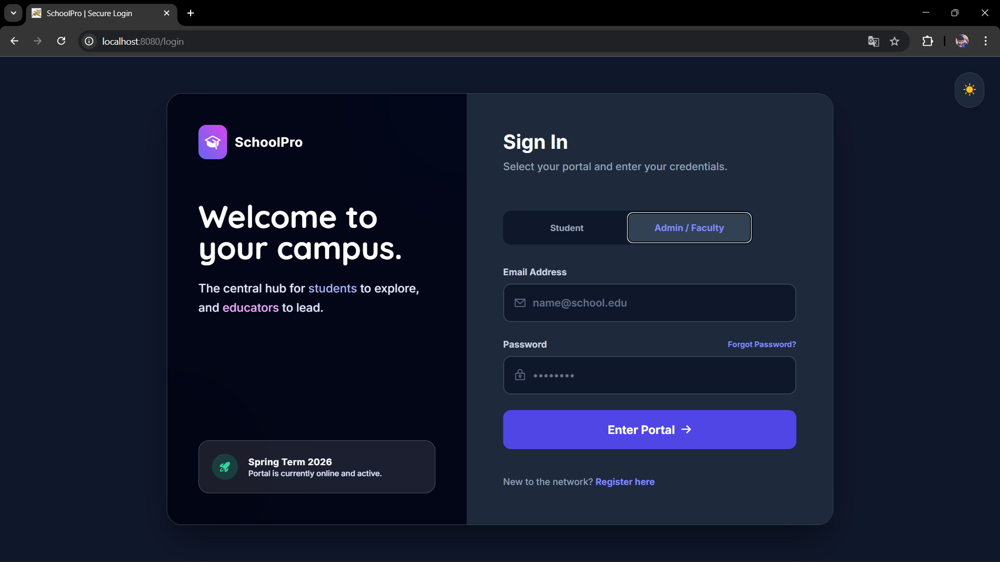
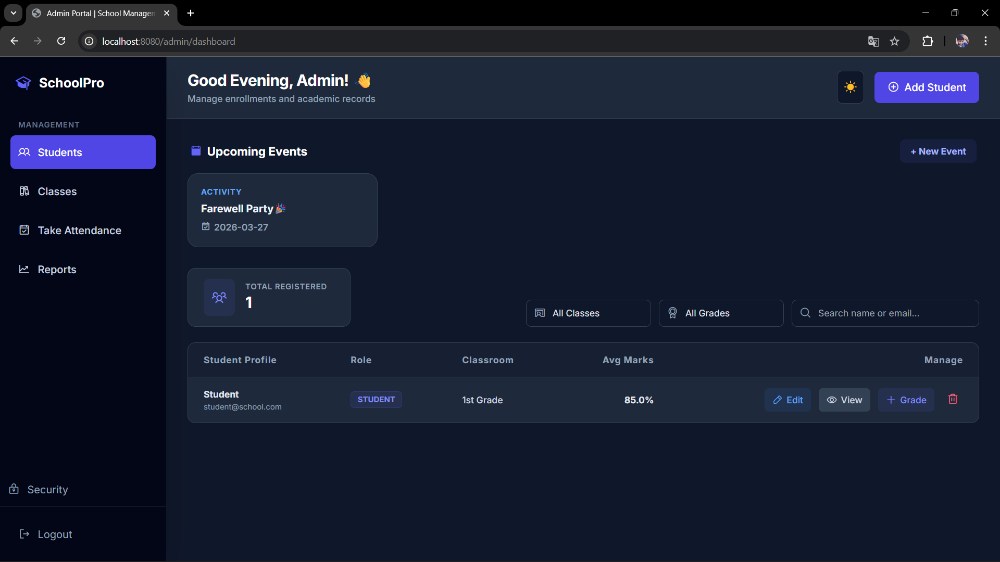
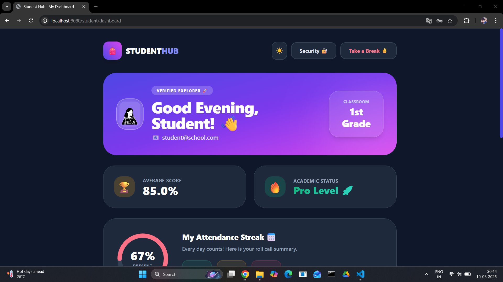
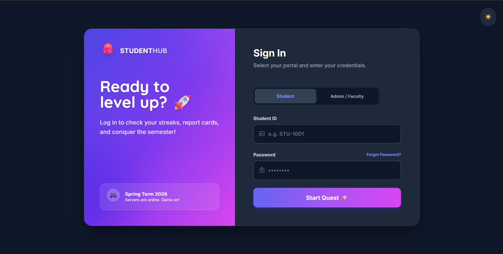

<div align="center">
  
</div>

<div align="center">
  
</div>

<br>

<div align="center">
  <em>A comprehensive, gamified academic management platform designed for the modern educational era. SchoolPro bridges the gap between administrators, educators, and students with a secure, responsive, and highly dynamic user architecture.</em>
</div>

<br>

## 🛠️ Tech Stack & Architecture

<div align="center">
  <a href="https://skillicons.dev">
    
  </a>
</div>

<br>

| Layer | Technologies Used |
| :--- | :--- |
| **Backend** | Java 17, Spring Boot 3, Spring Security, Spring Data JPA |
| **Database** | MySQL (Relational schema with many-to-one mapping) |
| **Frontend** | Thymeleaf, Tailwind CSS (Custom Dark Mode), JavaScript (ES6+) |
| **Integrations**| SMTP Server (Automated Emails), DiceBear API, Phosphor Icons |

---

## 🚀 Core Features

### 🔐 Advanced Security & Auth
* **Multi-Role Access Control:** Custom, secure dashboards for Admins, Teachers, and Students.
* **Multi-Factor Authentication:** OTP-based account verification using Spring Mail with HTML templates.
* **Secure Recovery:** Tokenized "Forgot Password" workflow with automated email delivery.

### 🎨 Premium UI/UX
* **Dynamic Theme Engine:** Seamless Light/Dark mode transitions synced across the entire application via `localStorage`.
* **Auto-Time Perception:** UI automatically shifts to Dark Mode after 6:00 PM and greets users based on their local time.
* **Gamified Student Hub:** Animated attendance rings, interactive "Quest" calendars, and visual grade tracking.

### 📊 Administrative Power
* **PDF Export Engine:** Automated, on-the-fly generation of attendance reports and student report cards.
* **Attendance Analytics:** Class-wide summary reports with dynamic percentage calculations.
* **Dynamic Academic Calendar:** Real-time event management (Exams, Holidays, Activities) that updates globally.

---

## 📸 Platform Gallery

<div align="center">
  <table>
    <tr>
      <td align="center"><b>Admin Login (Dark Mode)</b><br></td>
      <td align="center"><b>Admin Dashboard</b><br></td>
    </tr>
    <tr>
      <td align="center"><b>Student Dashboard</b><br></td>
      <td align="center"><b>Student Login</b><br></td>
    </tr>
  </table>
</div>

---

## 💡 Technical Challenges Overcome

1. **State Persistence:** Implemented a JavaScript-based theme manager that prevents "white flashes" by checking system preferences and `localStorage` before the DOM fully loads.
2. **Dynamic Reports:** Built a logic-heavy attendance summary engine that calculates percentages on the fly for PDF generation.
3. **Asynchronous UX:** Integrated AJAX fetches for student grade management to allow real-time updates without page reloads.

---

## ⚙️ Installation & Setup

**1. Clone the Repository:**
```bash
git clone [https://github.com/Mahesh-Konarasipalli/SchoolPro.git](https://github.com/Mahesh-Konarasipalli/SchoolPro.git)
